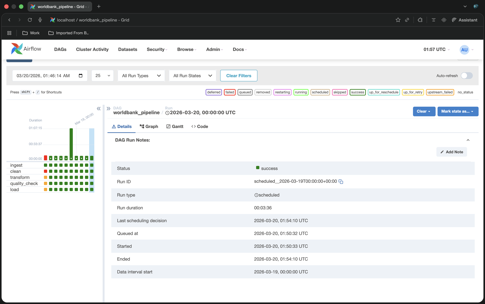

## Successful run

All 5 tasks completing in 3m 36s on 874K rows across 217 countries:



---

# World Bank Data Pipeline — Airflow + PostgreSQL

End-to-end data pipeline using Apache Airflow 2.8.1, orchestrating a
**medallion architecture** (bronze → silver → gold) with two PostgreSQL
instances and full pipeline observability.

---

## Architecture
```
CSV (143MB, 874K rows)
        │
        ▼
┌─────────────────────────────────────────────────────────┐
│  DAG: worldbank_pipeline  (@daily, max_active_runs=1)   │
│                                                         │
│  ingest → clean → transform → quality_check → load     │
└─────────────────────────────────────────────────────────┘
        │
        ▼
┌──────────────────────────────────┐
│  PostgreSQL: worldbank_pipeline  │
│  ├── raw_indicators    (bronze)  │
│  ├── cleaned_indicators (silver) │
│  ├── feature_matrix    (gold)    │
│  └── pipeline_run_log            │
└──────────────────────────────────┘
```

### Task breakdown

| Task | Layer | What it does |
|------|-------|--------------|
| `ingest` | Bronze | Reads CSV → bulk inserts into `raw_indicators`. Append-only. Fast-fail if required columns are missing. |
| `clean` | Silver | Replaces `..` World Bank nulls, casts types, deduplicates. Chunked reads (100K rows) to avoid OOM. Upserts to `cleaned_indicators`. |
| `transform` | Gold | Pivots long→wide, builds derived features (GDP per capita, debt-to-GDP), computes completeness metrics. Upserts to `feature_matrix`. |
| `quality_check` | Gold | Validates row count, null %, completeness, duplicate keys. Raises `AirflowException` on failure — stops pipeline before bad data reaches consumers. |
| `load` | Observability | Pulls XCom metrics from all upstream tasks, writes one summary row to `pipeline_run_log` with timing and quality results per run. |

### Key design decisions

- **Two Postgres instances** — `airflow_db` for Airflow metadata, `pipeline_db` for pipeline data. Separate concerns, separate backups.
- **Upsert pattern** (`ON CONFLICT DO UPDATE`) — every task is idempotent. Safe to re-run without duplicating data.
- **XCom for metrics** — row counts and task timing passed between tasks without re-querying the database.
- **`pipeline_run_log` table** — every run writes timing and quality results. Query this to monitor pipeline health.
- **Chunked reads in `clean`** — 100K row chunks prevent OOM on the 874K row dataset.
- **`LocalExecutor`** — same DAG code works with `CeleryExecutor` or `KubernetesExecutor` in production.

### Resume bullet mapping

| Bayer resume bullet | Where it lives in this pipeline |
|---------------------|----------------------------------|
| "Multi-layer ETL pattern" | Bronze → Silver → Gold in `sql/create_tables.sql` |
| "Daily Airflow DAGs" | `dags/worldbank_pipeline.py`, `@daily` schedule |
| "Data quality validation" | `tasks/quality_check.py` — 4 explicit checks |
| "SLA monitoring" | `pipeline_run_log` — per-task timing on every run |
| "De-dup logic using audit columns" | `cleaned_at`, `loaded_at` + `ON CONFLICT DO UPDATE` |
| "CI/CD via GitHub Actions" | Environment-variable injection, swappable per environment |

---

## Prerequisites

- Docker Desktop running
- ~4GB RAM available for containers
- World Bank source CSV (see Data section below)

---

## Setup

### 1. Clone and navigate
```bash
git clone https://github.com/VenkatAmit/A-World-Bank-Data-Study.git
cd A-World-Bank-Data-Study/airflow_pipeline
```

### 2. Configure environment
```bash
cp .env.example .env
```

Generate a Fernet key and paste it into `.env`:
```bash
python3 -c "import base64, os; print(base64.urlsafe_b64encode(os.urandom(32)).decode())"
```

Set `AIRFLOW__CORE__FERNET_KEY` and `AIRFLOW__WEBSERVER__SECRET_KEY` to this value.

### 3. Add source data

Download the World Bank imputed dataset and place it in `data/`:
```bash
mkdir -p data/
# Source: https://data.worldbank.org/
# Expected file: data/imputed_data_less_than_70_missing.csv (~143MB)
# Required columns: Country Name, Country Code, Series Name, Series Code,
#                   Quarter, Value, Year, Source, Indicator Category
```

### 4. Start the stack
```bash
docker-compose --env-file .env up -d
```

Wait ~60 seconds. Verify all containers are healthy:
```bash
docker-compose ps
```

Five services should be running:
- `airflow_db` — Airflow metadata Postgres
- `pipeline_db` — Pipeline data Postgres (accessible on port 5433)
- `airflow_init` — One-time DB migration + admin user (exits after success)
- `airflow_webserver` — UI at http://localhost:8081
- `airflow_scheduler` — Task orchestrator

### 5. Trigger the pipeline

Open **http://localhost:8081** — login with `admin` / `admin`

1. Find `worldbank_pipeline` in the DAGs list
2. Toggle it **on** (unpause)
3. Click ▶ to trigger a manual run
4. Click into the DAG → **Graph** tab to watch tasks turn green

---

## Querying results
```bash
psql -h localhost -p 5433 -U pipeline -d worldbank_pipeline
```
```sql
-- Pipeline run history
SELECT pipeline_run_id, rows_ingested, rows_cleaned, rows_loaded,
       quality_passed, total_duration_sec
FROM pipeline_run_log
ORDER BY run_started_at DESC;

-- Gold layer sample
SELECT country_code, country_name, year,
       gdp_growth_pct, inflation_pct, gdp_per_capita_usd,
       completeness_pct
FROM feature_matrix
ORDER BY country_code, year
LIMIT 20;

-- Row counts per layer
SELECT 'bronze' AS layer, COUNT(*) FROM raw_indicators
UNION ALL
SELECT 'silver'          , COUNT(*) FROM cleaned_indicators
UNION ALL
SELECT 'gold'            , COUNT(*) FROM feature_matrix;
```

---

## Stopping the stack
```bash
docker-compose down        # stop containers, keep data volumes
docker-compose down -v     # stop containers AND delete all data
```

---

## Data source

World Bank Open Data — https://data.worldbank.org/

Indicators from WDI (World Development Indicators), QPSD (Quarterly Public
Sector Debt), and SPI (Statistical Performance Indicators).
Data range: 2021–2023 · 217 countries
